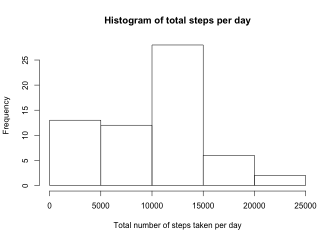
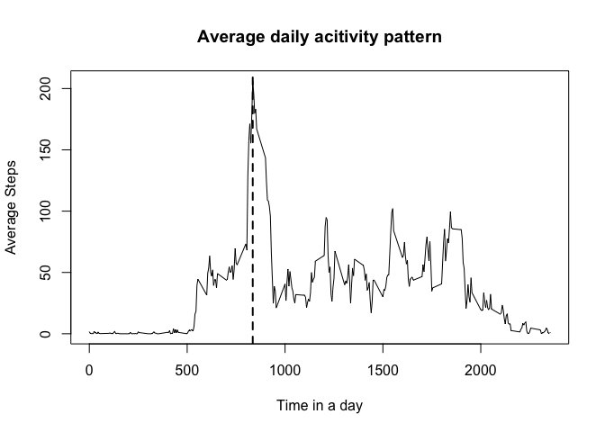
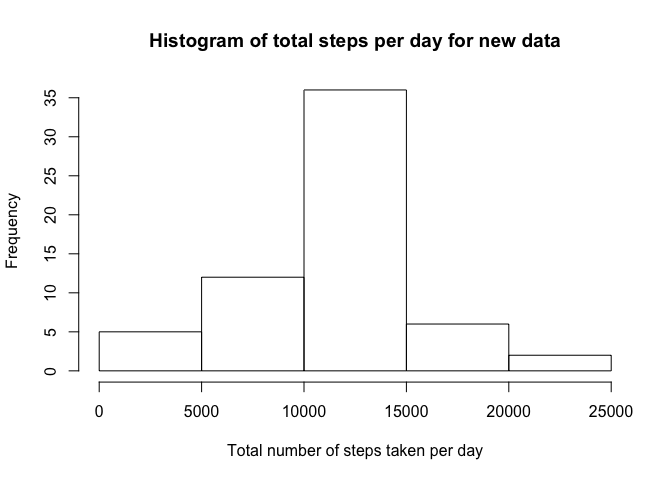
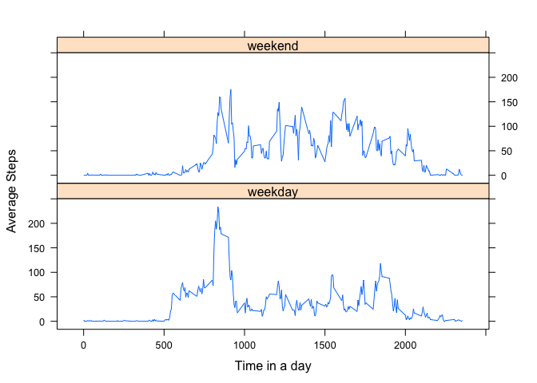

# Reproducible Research: Peer Assessment 1
Complete the entire assignment in a single R markdown document that can be processed by knitr and be transformed into an HTML file.

**Step 1: Load the raw data.**  
Show any code that is needed to  
1. Load the data (i.e. read.csv())  
2. Process/transform the data (if necessary) into a format suitable for your analysis  

Make sure the raw data is in the same folder of the code.  

```r
library(dplyr)
```

```
## 
## Attaching package: 'dplyr'
## 
## The following objects are masked from 'package:stats':
## 
##     filter, lag
## 
## The following objects are masked from 'package:base':
## 
##     intersect, setdiff, setequal, union
```

```r
library(lubridate)
fileName <- "activity.csv"
rawData <- read.csv(fileName,header = TRUE,na.strings = "NA",stringsAsFactors = FALSE)
## For some reason, I have to do two step mutate for this code to work instead of one. There is always some error coming out if I tried it in one line of code (i.e., one single mutate call.
data <- mutate(rawData, date = as.Date(strptime(date,"%Y-%m-%d")))
        # I found the following mutate command doesn't work with 'hm' function  in it. 
        # mutate(interval = hm(paste0(as.character(interval%/%100),":",
        #                            as.character(interval%%100))))
rm(rawData)
```

**Step2: What is mean total number of steps taken per day?**  
For this part of the assignment, you can ignore the missing values in the dataset.  
1. Calculate the total number of steps taken per day  
2. If you do not understand the difference between a histogram and a barplot, research the difference between them. Make a histogram of the total number of steps taken each day  
3. Calculate and report the mean and median of the total number of steps taken per day.  

First, group the data by date; Second, summarize the data based on the date when the data is taken. Then plot histogram of the steps over time


```r
data_1 <- group_by(data, date)
pack_sum_1 <- summarize(data_1, total_steps = sum(steps, na.rm=TRUE))
meanSteps = mean(pack_sum_1$total_steps)
medianSteps = median(pack_sum_1$total_steps)
hist(pack_sum_1$total_steps,main="Histogram of total steps per day",
     xlab = "Total number of steps taken per day",
     ylab = "Frequency")
```

 

The mean steps per day is 9354.2295082, and the median steps per day is 10395.

**Step 3: What is the average daily activity pattern?**  
1. Make a time series plot (i.e. type = "l") of the 5-minute interval (x-axis) and the average number of steps taken, averaged across all days (y-axis)  
2. Which 5-minute interval, on average across all the days in the dataset, contains the maximum number of steps?  


```r
data_2 <- group_by(data, interval)
pack_sum_2 <- summarize(data_2, avg_steps = mean(steps, na.rm=TRUE))
with(pack_sum_2, plot(interval, avg_steps, type='l', xlab="Time in a day",ylab="Average Steps", main="Average daily acitivity pattern"))
max_steps_interval = pack_sum_2$interval[which.max(pack_sum_2$avg_steps)]
time_max_step <- paste0(as.character(max_steps_interval%/%100), ":", as.character(max_steps_interval%%100))
if (max_steps_interval%/%100 < 12) 
        noon <- "morning" else 
        noon <- "afternoon"
abline(v=max_steps_interval, lty=2,lwd=2)
```

 

The time which contains the maximum number of steps is 8:35 in the morning.

**Step 4: Imputing missing values**  
Note that there are a number of days/intervals where there are missing values (coded as NA). The presence of missing days may introduce bias into some calculations or summaries of the data.  
1. Calculate and report the total number of missing values in the dataset (i.e. the total number of rows with NAs)  
2. Devise a strategy for filling in all of the missing values in the dataset. The strategy does not need to be sophisticated. For example, you could use the mean/median for that day, or the mean for that 5-minute interval, etc.  
3. Create a new dataset that is equal to the original dataset but with the missing data filled in.  
4. Make a histogram of the total number of steps taken each day and Calculate and report the mean and median total number of steps taken per day. Do these values differ from the estimates from the first part of the assignment? What is the impact of imputing missing data on the estimates of the total daily number of steps?

To fill in the missing data, I use the average steps for each interval. To do that, I merge the "data" and "pack_sum_2" so that it can automatically fill in the NAs. Before I fill the data, however, I need to make sure it is sorted correctly


```r
numofMissingData <- sum(is.na(data$steps))
mergedData <- merge(data, pack_sum_2, by="interval")
filled_data <- mergedData[with(mergedData, order(date, interval)),]
filled_data$steps[is.na(data$steps)] <- filled_data$avg_steps[is.na(data$steps)]
new_data <- select(filled_data,-avg_steps)
new_data <- group_by(new_data, date)
pack_sum_3 <- summarize(new_data, total_steps = sum(steps, na.rm=TRUE))
meanSteps_2 = mean(pack_sum_1$total_steps)
medianSteps_2 = median(pack_sum_1$total_steps)
meanStepChange = "changed"
medianStepChange = "changed"
if (meanSteps_2 == meanSteps) meanStepChange = "unchanged"
if (medianSteps_2 == medianSteps) medianStepChange = "unchanged"
if (meanStepChange == "changed" | medianStepChange == "changed") {impact = ""
                                                                  } else {
                                                                          impact = "NO"
                                                                  }
hist(pack_sum_3$total_steps,main="Histogram of total steps per day for new data",
     xlab = "Total number of steps taken per day",
     ylab = "Frequency")
```

 

There are 2304 missing testing point in this dataset.  
For the new data, the mean steps per day is 9354.2295082, and the median steps per day is 10395. The mean step is unchanged and the median step is unchanged. There is NO impact of inputing missing data.

**Step 5: Are there differences in activity patterns between weekdays and weekends?**  
For this part the weekdays() function may be of some help here. Use the dataset with the filled-in missing values for this part.  
1. Create a new factor variable in the dataset with two levels – “weekday” and “weekend” indicating whether a given date is a weekday or weekend day.  
2. Make a panel plot containing a time series plot (i.e. type = "l") of the 5-minute interval (x-axis) and the average number of steps taken, averaged across all weekday days or weekend days (y-axis). See the README file in the GitHub repository to see an example of what this plot should look like using simulated data.


```r
wkData <- data %>%
        mutate(week = ifelse (weekdays(date) == "Saturday"|weekdays(date) == "Sunday",
                              "weekend", "weekday"))
by_weekday_interval <- group_by(wkData, week, interval)
pack_sum_4 <- summarize(by_weekday_interval,avg_steps = mean(steps, na.rm = TRUE))
# Now plot the results. For conditioning plotting, it's better to use lattice plotting system
library(lattice)
xyplot(avg_steps ~ interval | week, pack_sum_4, type = "l",layout=c(1,2),xlab="Time in a day", ylab="Average Steps")
```

 

